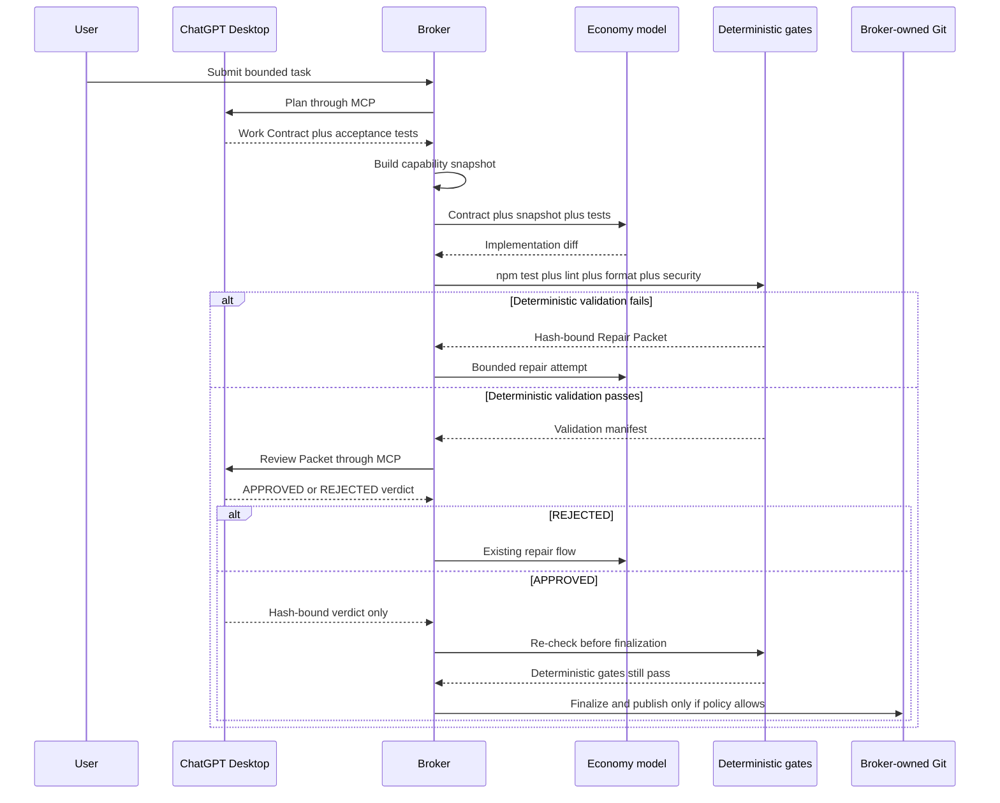

# Agent Orchestration Starter

Provider-neutral agent orchestration runtime and control plane for bounded,
evidence-driven repository work. A frontier-capable planner/reviewer can
delegate small implementation stories to a cheaper qualified worker while the
broker retains policy, sandbox, validation, review and publication authority.

```text
authorized task source
        │
        ▼
planner/frontier ── typed contract + capability snapshot ──► economy/frontier worker
        │                                                       │
        └────────────── broker-owned validation ◄───────────────┘
                              │
                        independent review
                              │
               local commit → exact-SHA PR/merge (optional)
```

The stable policy describes roles, capabilities, repository boundaries and
acceptance criteria. Provider, model, harness, tool parser, guidance and
skill bundles are replaceable profile data. A model response is never an
authority to widen the contract, choose a route, approve its own output or
publish a commit.

Execution is capability-adaptive: mechanical work can use the cheapest
qualified worker, semantic/cross-file work can use a distinct economical
reasoning worker, and unsupported or high-risk work elevates to frontier. The
broker hashes per-run step, tool, mutation-latency, timeout, attempt and repair
limits into the contract; see [adaptive execution](docs/adaptive-execution-v4.md).
Broker-owned health snapshots now remember failures per exact binding and task
trait. Repeated failure automatically quarantines only that pair and contracts
the next route to a qualified reasoning/frontier worker; recovery requires
cooldown plus clean canaries. Models cannot alter this evidence or promote
themselves.

## Status

This repository is pre-1.0. Runtime V4 is a fail-closed framework with a
portable installer, not a universal unattended production service. The
production host driver, credential gateway, native coordinator, provider
gateway, sandbox and exact binding qualification are deployment obligations.
The current native broker evidence is for Linux x64; Windows and macOS need
separate host evidence. See the [compatibility matrix](docs/compatibility-matrix-v4.md).

## Architecture

The broker is the only component that owns repository mutation, deterministic
validation, review gating and publication. ChatGPT Desktop can act as the
read-only frontier planner/reviewer through the generated MCP binding, while
the Economy worker receives a bounded contract and capability snapshot. The
review verdict is evidence, not a publication command: `APPROVED` never skips
validation and never finalizes or publishes a run by itself.



The complete contract, trust boundaries and operator procedures are in the
[MCP and strict SDD architecture guide](docs/architecture-mcp-sdd.md).

## Quick start

Requires Node.js 20 or newer.

```powershell
npm ci
npm run validate
npm run build
node dist/cli/main.js init `
  --target G:\_Proyectos\my-project `
  --policy orchestration.yaml `
  --profile profiles/open-compatible.yaml `
  --harnesses codex,opencode `
  --dry-run
```

After inspecting the proposed files, run the same initialization without
`--dry-run` to materialize them. Use `check` to detect local drift and `doctor`
to verify the same selected harnesses. The CLI does not write credentials or
global tool configuration.

For OpenCode, initialization manages only `<target>/opencode.json` and the
target repository's `.opencode/agents/`. It never writes personal, user-level,
home-directory or global OpenCode configuration; an existing unmanaged project
config is reported as a conflict instead of being overwritten.

```powershell
node dist/cli/main.js init `
  --target G:\_Proyectos\my-project `
  --policy orchestration.yaml `
  --profile profiles/open-compatible.yaml `
  --harnesses codex,opencode
node dist/cli/main.js check --target G:\_Proyectos\my-project --policy orchestration.yaml --profile profiles/open-compatible.yaml --harnesses codex,opencode
node dist/cli/main.js doctor --harnesses codex,opencode --policy orchestration.yaml --profile profiles/open-compatible.yaml
```

For ChatGPT Desktop orchestration and review, use the host activation flow in
the [MCP setup guide](docs/architecture-mcp-sdd.md#connecting-chatgpt-desktop).
It generates a required local STDIO MCP binding with keyring-backed ChatGPT
authentication and does not require an OpenAI API key for the read-only
frontier path. The Economy executor remains a separate profile binding and
may require its own provider credential. Never copy `auth.json` or an API key
into a repository, worktree or capsule.

## Autonomous lifecycle

The intended autonomous loop is bounded and durable:

1. A privileged task source admits an allowlisted candidate under a lease.
2. A frontier planner turns it into a complete typed contract and sizes
   stories for the active worker capability.
3. The broker creates an isolated worktree/capsule and starts one story in a
   fresh coding context.
4. The qualified worker edits only contract-authorized paths and runs the
   declared deterministic validations.
5. The broker re-inspects paths, records evidence and sends a clean bounded
   review packet to an independent reviewer.
6. Failures become verified repair packets; repeated normalized failures
   escalate or stop instead of looping forever.
7. Finalization creates a local commit. Publication, if policy allows it, is a
   broker-owned exact push, PR, required-check and head-bound merge sequence.

The [iterative executor](docs/iterative-executor-v4.md) is inspired by Ralph:
one dependency-ready story per context, explicit budgets and retry from the
last accepted tree. It is not a free-running shell loop. The model cannot mark
its own story complete, read prior hidden reasoning, grant itself tools or
publish changes.

When the frontier is the decision owner, select frontier-led review control.
Each rejected attempt then returns `AWAITING_FRONTIER_DECISION`; retry requires
a durable, self-hashed frontier decision bound to that persisted event. The
following iteration binds the decision hash, so crash replay can prove which
owner and authority evidence authorized another economical-worker attempt.
`AUTONOMOUS_BROKER` remains a distinct mode for hosts with separately qualified
automatic retry policy.

Hosts that want the complete automatic cycle should call
`runFrontierSupervisorV4`. It drives `AWAITING_FRONTIER_DECISION` through a
host-supplied, provider-neutral frontier decision port, persists the exact
authorization, starts a clean bounded repair attempt and repeats until
completion, escalation, iteration limit or budget failure. Configuration files
alone do not start this loop; the admitted-run pipeline must invoke it.

For deployments that require economical-worker delegation, enable the signed
[delegation provenance gate](docs/delegation-provenance-v4.md). The privileged
host signs the exact finalized commit and accepted worker/review evidence with
Ed25519. Publication can then fail closed before push when the evidence is
missing, stale, forged, or replaced by an unapproved frontier-only shortcut.
The gate is opt-in for compatibility; instructions in `AGENTS.md` are not a
substitute for enabling it at the broker/publication boundary.

The outer [autonomous dispatcher](docs/autonomous-dispatcher-v4.md) starts in
`PAUSED`, requires a durable transition to `RUNNING`, recovers leases and
rechecks the exact merge SHA after publication. Circuit recovery also requires
an explicit paused/reactivation sequence.

## Adopting in another repository

Use the [consumer adoption guide](docs/consumer-adoption-v4.md) to choose and
name the actual trust level: pattern-only, bounded local delegation,
analysis-only activation, certified isolated execution or autonomous
publication. The guide provides a clone-to-analysis walkthrough and a handoff
checklist based on real consumer integration patterns.

`profiles/nan-opencode.example.yaml` keeps ChatGPT-authenticated Codex as the
orchestrator and reviewer, with OpenCode using `qwen3.6` for the first NaN
attempt and, when the contract allows another attempt, a clean retry from the
last accepted tree. The profile deliberately does not qualify repair from a
failed candidate tree. Semantic debugging and cross-file tasks use
the separately qualified `reasoningExecutor`; rejected repairs use
`escalationExecutor`, while direct `FRONTIER` work resolves
`frontierExecutor` independently. The example currently binds those three
roles to `deepseek-v4-flash`, but the roles and routing are model-neutral. The broker routes the
OpenAI-compatible Chat Completions API through its gateway: the capsule sees
only the non-secret `broker-gateway` value, while the real NaN key remains in
the gateway. Economy concurrency is one to avoid multiplying usage pressure.
Codex runs outside the capsule through the fail-closed
[ChatGPT subscription host bridge](docs/host-codex-subscription-v4.md); it has
read-only review authority and never receives an executor binding.

NaN currently documents 500M monthly tokens for DeepSeek V4 Flash, 1.0B for
MiMo V2.5, and separate premium GLM 5.2 limits. Qwen3.6 and Gemma4 do not list
an equivalent monthly quota on that page. Treat quotas as dated operational
metadata, not routing authority, and qualify the exact live binding before
unattended execution.

Pin a release tag and full commit for every pilot. A project-local wrapper,
model permission rule or post-run path check can be useful, but none of them is
Runtime V4 hard-isolation evidence by itself.

## Routing and evidence

The supported strategies are:

- `economy_only`: localized mechanical work with a qualified economical worker;
- `orchestrated`: frontier planning/review around a bounded economical worker;
- `frontier_execution`: frontier worker for security, architecture, ambiguity,
  migrations or other high-risk work.

The routing gate is advisory and does not change routing automatically. V2
requires at least 30 comparable pairs per `taskClass × candidate ×
frontier_execution`, matched by `taskId + caseFingerprint`. It protects both
first-pass and final acceptance; no cheaper candidate may reduce final
acceptance under the conservative initial policy. Escalations, repairs and
rescues remain part of real cost. See [routing gate](routing-gate.yaml), the
[benchmark examples](examples/benchmark-observations.jsonl), and the
[historical evidence-based routing design](docs/plans/2026-08-08-evidence-based-routing-design.md).

```powershell
node dist/cli/main.js benchmark `
  --observations examples/benchmark-observations.jsonl `
  --routing-policy routing-gate.yaml
```

The offline V3 pilot separates append-only observations from later evaluation,
preserves incomplete usage as incomplete, and never invents missing evidence.
It does not invoke a provider, merge code or promote a route.

## Provider and model neutrality

The orchestrator selects roles and capabilities, not permanent vendor names.
Each binding carries a versioned guidance pack, inference controls, tool/parser
identity and qualification evidence. Changing a model or provider profile does
not require changing repository contracts, but it does require fresh exact
qualification of the new binding. A model name alone is never evidence.

`profiles/runtime.example.yaml` is intentionally provider-neutral.
`profiles/nan-opencode.example.yaml` and
`profiles/runtime.chatgpt-subscription.example.yaml` are dated examples, not
credentials or live-certification claims. An economical worker may be Qwen,
Gemma, a future provider or a local model; the frontier planner sizes stories
from the worker's declared capability and limits rather than assuming a fixed
model.

Choose bindings per repository rather than establishing a global vendor
default. The [project profile selection guide](docs/profile-selection-v4.md)
compares the mixed ChatGPT-subscription + NaN topology, the Sol + Luna OpenAI
topology and a fully replaceable template. It also makes the authentication
boundary explicit: a ChatGPT subscription can back read-only orchestration and
review, but it is not an API credential for a writable Luna or Sol executor.

The runtime rejects malformed native tool protocols and textual pseudo-calls
such as `<tool_call>`; it does not convert them into executable authority.
External agent runtimes and sandbox launchers must pass the
[qualification procedure](docs/external-runtime-qualification-v4.md) before
they can back a trusted component. Container use alone does not imply hard
isolation.

## Runtime V4 and the host boundary

Runtime V4 provides strict contracts, capability gates, isolated executor and
reviewer building blocks, deterministic validation, bounded telemetry,
durable broker state, a daemon/IPC composition factory, a content-addressed
installer and hash-bound repository activation.

The privileged host is split into eight separately certified ports: task
source, issue planner, practice-pack resolver, credential gateway, sandbox
coordinator, capability issuer, GitHub publisher and post-merge verifier. The
thin root verifies each module, dependency certificate, interface and
aggregate composition before importing it. See [modular host components](docs/modular-host-components-v4.md)
and [host installation](docs/host-installation-v4.md).

The project deliberately does not ship saved ChatGPT/Codex authentication,
provider API keys or a universal production host implementation. Missing or
unqualified host evidence fails closed with `CAPABILITY_UNVERIFIED`; there is
no direct-edit fallback. The same central installation can serve unrelated
repositories, but each repository supplies its own policy, profile, activation
and publication decision.

The Linux native broker helper is built for the target architecture and is
never compiled at runtime. Windows and macOS may run the portable JavaScript
surfaces where their exact host/coordinator/sandbox evidence supports them;
Linux evidence must not be reused implicitly.

## Package API

The default `agent-orchestration-starter/runtime-v4` entry point is deliberately
small. Low-level boundaries are explicit:

- `agent-orchestration-starter/runtime-v4/contracts`
- `agent-orchestration-starter/runtime-v4/host`
- `agent-orchestration-starter/runtime-v4/experimental`

See the [public API contract](docs/runtime-public-api-v4.md). Internal emitted
modules are not package API merely because they exist in `dist/`.

## Installation, publication and release

Install Runtime V4 once on a trusted machine, then activate each repository
against a content-hashed installation. The activation binds policy, profile,
target and aggregate host composition. Profile-only changes need fresh
binding qualification; host bytes, components, native helpers or composition
changes need dependency-aware recertification and a new installation.

Publication is optional and repository-owned. It never force-pushes, deletes
branches, deploys or lets a model choose the PR/merge settings. A formal `0.x`
release emits a validated npm tarball, checksum, SBOM and build provenance;
the release workflow is tag-driven and its GitHub Actions are pinned by SHA.
The native tarball is intentionally produced on certified Linux x64 only;
local `npm pack` on Windows/macOS fails closed instead of emitting a package
that falsely claims to contain a Linux broker helper.

## Security and contribution

Read the [repository threat model](docs/threat-model-v4.md) and
[security policy](SECURITY.md) before changing sandboxing, credentials, IPC,
host installation, publication or model qualification. The [contribution
contract](CONTRIBUTING.md) explains required validation, evidence and migration
notes. Public issues, pull requests and examples must also follow the
[public repository hygiene guide](docs/public-repository-hygiene.md).

## Documentation map

- [Consumer adoption and handoff](docs/consumer-adoption-v4.md)
- [Project profile selection](docs/profile-selection-v4.md)
- [Adaptive provider-neutral execution](docs/adaptive-execution-v4.md)
- [Public repository hygiene](docs/public-repository-hygiene.md)
- [Runtime operations](docs/runtime-v4-operations.md)
- [MCP, strict SDD and context culling](docs/architecture-mcp-sdd.md)
- [Control plane](docs/control-plane-v4.md)
- [Frontend/backend practice packs](docs/delegation-practice-packs-v4.md)
- [Harness adapters and delegation proof](docs/harness-adapters-v4.md)
- [Model guidance](docs/model-guidance-v4.md)
- [Publication](docs/publication-v4.md)
- [Portable runtime inspection](docs/portable-runtime-inspection-v4.md)
- [Optional A2A projection](docs/a2a-adapter-v1.md)
- [Activation readiness](docs/activation-readiness-v4.md)
- [Controlled dogfooding protocol V1](docs/dogfooding-v1.md)
- [Architecture review](docs/research/architecture-review.md)
- [Consolidation roadmap](docs/plans/2026-08-10-runtime-consolidation-roadmap.md)

MIT license.
